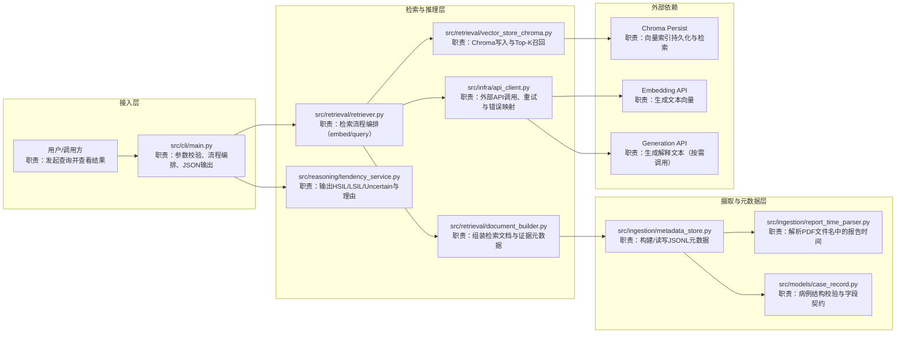
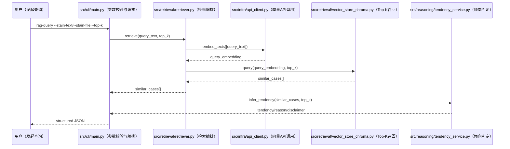
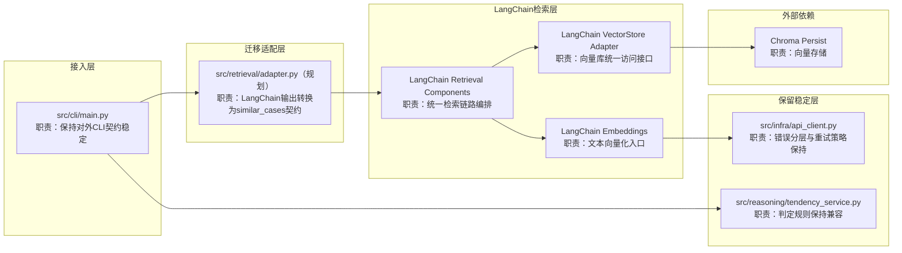

# Architecture（V2 文档重构版，含中文图注）

## 1. 目标与原则
1. 目标：让 AI 与人类都能快速看懂“入口 -> 检索 -> 判定 -> 输出”。
2. 图注规则（强制）：
   - 每个节点都写“脚本路径 + 中文职责短注释”。
   - 节点注释保持短句，详细细节放到模块职责表。
3. 一致性规则：
   - 图中节点必须能在模块职责总表中找到对应条目。
   - 图中的模块名与代码路径保持一致。

## 2. 当前系统上下文图（V1 Baseline，中文注释版）

## 3. 关键链路时序图（Query，中文注释版）

## 4. V2 目标架构图（渐进迁移，中文注释版）

## 5. 模块职责总表（当前实现）
| 模块 | 文件路径 | 核心职责 | 输入 | 输出 | 依赖 | 错误类型 |
|---|---|---|---|---|---|---|
| ingestion.case_scanner | `src/ingestion/case_scanner.py` | 扫描病例目录并校验完整性 | data_root | scanned cases/issues | case_record | ScanIssue 类错误 |
| ingestion.text_cleaner | `src/ingestion/text_cleaner.py` | UTF-8 读取与控制字符清洗 | text/file | cleaned text | Python stdlib | `TextCleaningError` |
| ingestion.report_time_parser | `src/ingestion/report_time_parser.py` | 解析 PDF 文件名报告时间 | filename/path | datetime | `datetime`/`re` | `ReportTimeParseError` |
| ingestion.metadata_store | `src/ingestion/metadata_store.py` | 构建并读写 JSONL 元数据 | scanned case + text | metadata rows | parser, case_record | 元数据读写错误 |
| retrieval.document_builder | `src/retrieval/document_builder.py` | 构建检索文档对象 | metadata + text | retrieval documents | ingestion metadata | `DocumentBuildError` |
| retrieval.vector_store_chroma | `src/retrieval/vector_store_chroma.py` | Chroma upsert/query | vectors/docs | top-k similar cases | chromadb | `VectorStoreError` |
| retrieval.retriever | `src/retrieval/retriever.py` | 编排向量检索主链路 | query/top_k | similar_cases | api_client, vector_store | `RetrieverError` |
| reasoning.tendency_service | `src/reasoning/tendency_service.py` | 倾向判定与理由输出 | similar_cases | tendency payload | retrieval schema | `ValueError` |
| infra.api_client | `src/infra/api_client.py` | API 调用、重试、错误映射 | texts/prompt | embeddings/text | httpx, env | `ApiTimeoutError/ApiAuthError/ApiRateLimitError/ApiResponseError` |
| cli.main | `src/cli/main.py` | 参数校验、流程编排、结构化输出 | CLI args | JSON + exit code | retriever, tendency | `CliArgumentError` |

## 6. STEP-11 修订记录（本轮）
1. 变更类型：需求变化/重构（docs-only）。
2. 变更内容：
   - 三张架构图全部改为“节点内中文职责注释”。
   - 通过分层子图明确脚本位置与职责边界。
3. 变更原因：
   - 提升人类可读性，降低跨角色沟通成本。
4. 执行边界：
   - only executing current step scope.
5. updated_at: 2026-02-23

