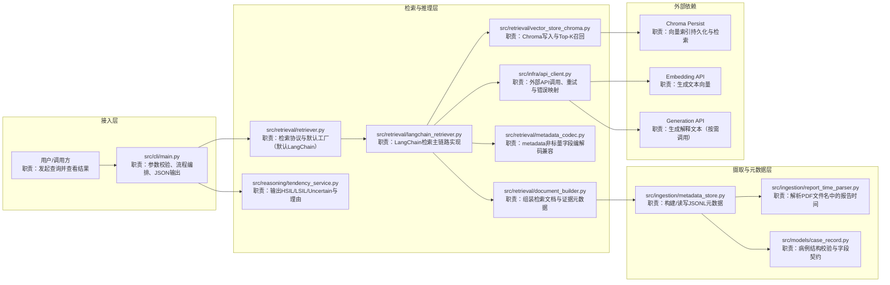
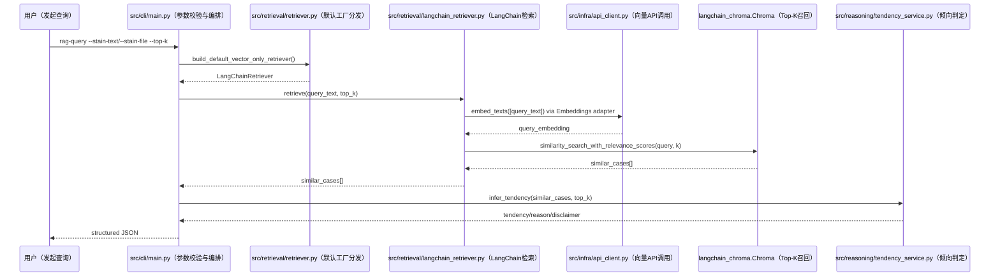
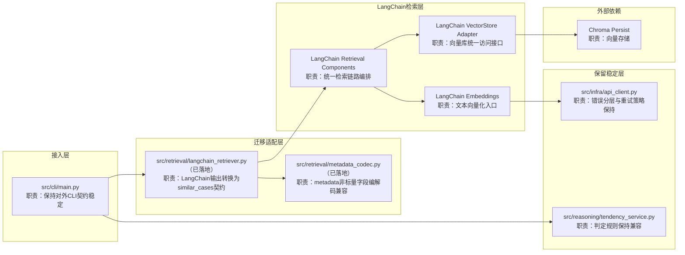

# Architecture（V2，v3.1 对齐）

## 文档目的
1. 描述系统当前架构、目标架构与关键链路。
2. 明确模块职责与依赖边界，减少跨角色理解偏差。
3. 为需求评审、重构评估、里程碑回填提供依据。

## 范围内
1. 当前系统上下文图、关键时序图、V2 目标架构图。
2. 模块职责总表（文件路径、输入输出、依赖与错误类型）。
3. 架构层面的变更记录与原因说明。

## 范围外
1. 临时执行日志、测试过程与命令清单。
2. 具体实现细节代码与参数调优细节。
3. 非架构层面的流程治理记录（由 `progress.md` 承担）。

## 真源文档
1. `C:\Users\ljh\Desktop\workflow\工作流v3.1.txt`

## 依赖文档
1. `memory-bank/prd.md`
2. `memory-bank/tech-stack.md`
3. `memory-bank/implementation-plan.md`
4. `memory-bank/progress.md`

## 更新触发
1. 完成主要功能或里程碑后。
2. 模块边界、核心依赖、主流程入口发生变化时。
3. 需求变化/重构导致职责映射变化时。

## 验收锚点
1. 图中节点与模块职责表一一对应。
2. 图内节点均包含“脚本路径 + 中文职责短注释”。
3. 目标架构与 `tech-stack.md` 的迁移目标一致。

## 更新时间
2026-02-23

## 1. 目标与原则
1. 目标：让 AI 与人类都能快速看懂“入口 -> 检索 -> 判定 -> 输出”。
2. 图注规则（强制）：
   - 每个节点都写“脚本路径 + 中文职责短注释”。
   - 节点注释保持短句，详细细节放到模块职责表。
3. 一致性规则：
   - 图中节点必须能在模块职责总表中找到对应条目。
   - 图中的模块名与代码路径保持一致。

## 2. 当前系统上下文图（V1 Baseline，中文注释版）

## 3. 关键链路时序图（Query，中文注释版）

## 4. V2 目标架构图（渐进迁移，中文注释版）

## 5. 模块职责总表（当前实现）
| 模块 | 文件路径 | 核心职责 | 输入 | 输出 | 依赖 | 错误类型 |
|---|---|---|---|---|---|---|
| ingestion.case_scanner | `src/ingestion/case_scanner.py` | 扫描病例目录并校验完整性 | data_root | scanned cases/issues | case_record | ScanIssue 类错误 |
| ingestion.text_cleaner | `src/ingestion/text_cleaner.py` | UTF-8 读取与控制字符清洗 | text/file | cleaned text | Python stdlib | `TextCleaningError` |
| ingestion.report_time_parser | `src/ingestion/report_time_parser.py` | 解析 PDF 文件名报告时间 | filename/path | datetime | `datetime`/`re` | `ReportTimeParseError` |
| ingestion.metadata_store | `src/ingestion/metadata_store.py` | 构建并读写 JSONL 元数据 | scanned case + text | metadata rows | parser, case_record | 元数据读写错误 |
| retrieval.document_builder | `src/retrieval/document_builder.py` | 构建检索文档对象 | metadata + text | retrieval documents | ingestion metadata | `DocumentBuildError` |
| retrieval.vector_store_chroma | `src/retrieval/vector_store_chroma.py` | Chroma upsert/query + metadata 非标量字段编码恢复 | vectors/docs | top-k similar cases | chromadb | `VectorStoreError` |
| retrieval.metadata_codec | `src/retrieval/metadata_codec.py` | metadata 非标量字段 JSON 编解码（兼容 Chroma scalar 限制） | metadata dict | sanitized/restored metadata | json | `ValueError` |
| retrieval.langchain_retriever | `src/retrieval/langchain_retriever.py` | LangChain 检索主链路、结果契约映射 | query/top_k 或 documents | similar_cases / upsert side effect | ApiClient, langchain-chroma, metadata_codec | `RetrieverError` + API 分层错误 |
| retrieval.retriever | `src/retrieval/retriever.py` | 检索协议定义与默认工厂（默认返回 LangChainRetriever） | collection_name | retriever instance | ApiClient, langchain_retriever | `RetrieverError` |
| reasoning.tendency_service | `src/reasoning/tendency_service.py` | 倾向判定与理由输出 | similar_cases | tendency payload | retrieval schema | `ValueError` |
| infra.api_client | `src/infra/api_client.py` | API 调用、重试、错误映射 | texts/prompt | embeddings/text | httpx, env | `ApiTimeoutError/ApiAuthError/ApiRateLimitError/ApiResponseError` |
| cli.main | `src/cli/main.py` | 参数校验、流程编排、结构化输出 | CLI args | JSON + exit code | retriever, tendency | `CliArgumentError` |

## 6. 变更记录（关键里程碑）
1. STEP-11（docs-only）：
   - 三张架构图改为“节点内中文职责注释”。
   - 通过分层子图明确脚本位置与职责边界。
   - 人类提交 `commit_ref: c44e8e7`（2026-02-23T09:14:36+08:00）。
2. 本轮独立任务（工作流 v3.1 对齐）：
   - 增补 v3.1 通用模板字段。
   - 对齐状态机、门禁与文档边界语义。
3. STEP-12（EPIC-V2-LANGCHAIN-DESIGN，docs-only）：
   - 新增 `memory-bank/feature-12-langchain-design.md`，冻结 Retriever Adapter 接口、数据流、错误映射与兼容性约束。
   - 不引入运行时代码变更，不改变对外 CLI 契约与错误分层语义。
   - 人类提交 `commit_ref: ce60db5`（2026-02-23T11:35:29+08:00）。
4. STEP-13（EPIC-V2-TEST-POLICY）：
   - 新增 `memory-bank/feature-13-test-policy.md`，沉淀边界条件矩阵（保留/合并/删除）与回归映射。
   - 在 `src/retrieval/vector_store_chroma.py` 增加 metadata 非标量字段（list/dict）编码与查询恢复能力，修复 Chroma scalar 限制导致的失败路径。
   - `vibe-rag` 环境下回归通过：`conda run -n vibe-rag python -m pytest -q tests`（51 passed）。
   - 人类提交 `commit_ref: f14a470`（2026-02-23T12:01:19+08:00），STEP-13 已完成收口。
5. STEP-14（EPIC-V2-RETRIEVAL-REFACTOR，ing）：
   - 新增 `src/retrieval/langchain_retriever.py`，落地 LangChain 检索主链路与 `similar_cases` 输出契约映射。
   - 新增 `src/retrieval/metadata_codec.py`，统一 metadata 非标量字段编解码逻辑；`vector_store_chroma` 与 LangChain 链路复用同一策略。
   - `src/retrieval/retriever.py` 默认工厂切换至 LangChain 实现，保留 `VectorOnlyRetriever` 兼容路径。
   - `vibe-rag` 环境下全量回归通过：`conda run -n vibe-rag python -m pytest -q tests`（55 passed）。
6. 执行边界：
   - only executing current step scope.
